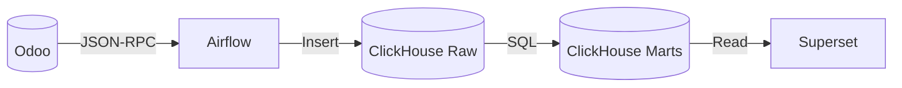
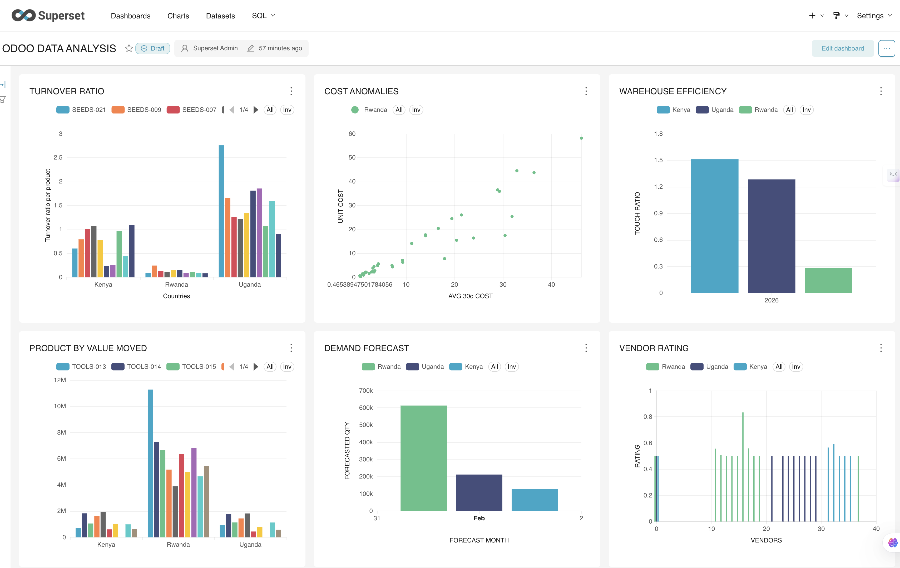

# data-pipeline

A local, Docker-based analytics pipeline that extracts inventory data from Odoo, lands it in ClickHouse, and builds marts for BI dashboards (Superset).

## Project status

- Assumption: MVP (production-like but still evolving).

## Why it is built this way

- **ClickHouse for marts**: columnar storage keeps analytical queries fast and predictable.
- **Raw tables + marts**: separating ingestion from reporting logic keeps reloads cheap and makes marts reproducible.
- **Airflow with watermarks**: incremental loads avoid full reprocessing while keeping idempotency.
- **Local-first Docker setup**: reproducible dev environment and easy onboarding.

## Architecture (high level)



- Odoo (source system)
- Airflow DAG extracts Odoo models via JSON-RPC
- ClickHouse raw tables store extracts
- ClickHouse marts compute analytics
- Superset reads marts for dashboards

## Infrastructure components

- **Airflow**: orchestrates extraction + mart builds
  - Scheduler, webserver, workers, and triggerer
  - Backed by Postgres + Redis (CeleryExecutor)
- **ClickHouse**: analytics warehouse + marts
- **Odoo 17**: source system
- **Superset**: BI UI for marts
- **Postgres/Redis**: Airflow and Superset dependencies

## Repository layout

- `airflow/` Airflow DAGs and configuration
- `clickhouse/` ClickHouse user config for local dev
- `odoo/` Odoo seeders + data generation (see `odoo/README.md`)
- `scripts/` Maintenance helpers
- `superset/` Superset Docker image and config
- `docker-compose.yml` Root compose file for the full stack

## Prerequisites

- Docker + Docker Compose
- `psql` available on host (for DB reset script)
- Python 3.10+ if you run Odoo seeders locally (see `odoo/README.md`)

## Quick start (local)

1) Start the stack:

```bash
docker compose up --build
```

2) Initialize Airflow metadata DB (if first run):

```bash
docker compose run --rm airflow-init
```

3) Configure Airflow connections (required by the DAG):

Create the following connections (via UI or CLI). The IDs below must match what is used in your DAGs.

```bash
# Example: Create connections via CLI
# Odoo (Source)
docker compose exec airflow-webserver airflow connections add 'odoo_default' \
    --conn-type 'http' --conn-host 'odoo' --conn-port '8069' \
    --conn-login 'gedeoniyonkuru@gmail.com' --conn-password 'gedeon' \
    --conn-extra '{"scheme":"http","db":"odoo","api_path":"/jsonrpc"}'

# ClickHouse (Destination)
docker compose exec airflow-webserver airflow connections add 'clickhouse_default' \
    --conn-type 'generic' --conn-host 'clickhouse' --conn-port '9000'

# Superset (BI Trigger)
docker compose exec airflow-webserver airflow connections add 'superset_default' \
    --conn-type 'http' --conn-host 'superset' --conn-port '8088' --conn-login 'admin' --conn-password 'admin'
```

*Note: Ensure the Connection IDs (`odoo_default`, etc.) match the variables or defaults in your DAG code.*

4) Import Airflow variables (defaults provided):

```bash
docker compose exec airflow-webserver airflow variables import /opt/airflow/dags/variables.json
```

5) Run the DAG locally:

```bash
docker compose exec airflow-webserver airflow dags test odoo_clickhouse_inventory_analytics 2024-01-15
```

## Key pipeline logic

- **DAG**: `airflow/dags/odoo_clickhouse_inventory_analytics.py`
  - Extracts Odoo models into ClickHouse raw tables
  - Builds marts like inventory turnover, vendor rating, stockout risk
  - Uses ReplacingMergeTree + `write_date` for idempotency

## Odoo data seeding

For realistic inventory history, use the Odoo seeders:

- Entry point: `odoo/main.py`
- Detailed usage: `odoo/README.md`

## Scripts (maintenance)

- `scripts/reset_airflow_clickhouse.py`
  - Resets Airflow variables/watermarks and truncates all ClickHouse tables
  - Use this before a clean, deterministic DAG test run

```bash
python scripts/reset_airflow_clickhouse.py
```

- `scripts/reset_odoo_db.sh`
  - Recreates the `odoo` database and re-initializes the base module
  - Requires local `psql` access on the host

```bash
chmod +x scripts/reset_odoo_db.sh
./scripts/reset_odoo_db.sh
```

## Superset ClickHouse connection (UI)

Use these values in Superset's "Add Database" form:

- Database Name: `ClickHouse`
- SQLAlchemy URI: `clickhouse+http://default:@clickhouse:8123/default`

If you prefer the Basic fields instead of URI:

- Host: `clickhouse`
- Port: `8123`
- Database: `default`
- Username: `default`
- Password: (leave blank)

## Access points (default ports)

| Service | URL | Default Creds |
|---------|-----|---------------|
| **Airflow** | `http://localhost:8080` | `airflow` / `airflow` |
| **Superset** | `http://localhost:8088` | `admin` / `admin` |
| **Odoo** | `http://localhost:8069` | `admin` / `admin` |
| **ClickHouse** | `http://localhost:8123` | (User: `default`, No password) |

## Extending the pipeline

- Add new source models in the DAG and map to raw tables.
- Add marts in ClickHouse SQL after raw extraction.
- Prefer small, composable marts over monolithic queries.

## Sample dashboard
After you connect Superset to ClickHouse and add the marts, you can build a dashboard like the one below to track inventory health, movement velocity, and aging across warehouses.



## License

MIT. See `LICENSE`.
